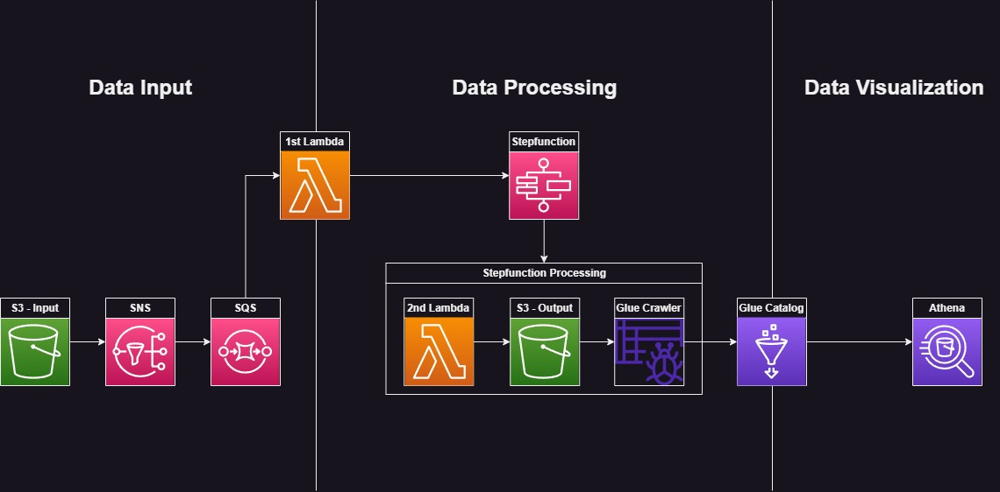

# Supermarket Data Pipeline in AWS #

## **1 - Purpose**

The purpose of this project is to create a structure that can solve a business case and deploy automatically through Terraform, without the need to create resources through the AWS console.

## 2 - Customer case
- A supermarket receives a general report of its sales every day and wants this data to be used for analysis by the BI team.
- Whenever a new file is received, it must be transformed so that only data that makes sense to the BI team is present.
- This new data should feed the file with data from previous days e.g.
- It must be possible to view and perform SQL queries on this data in a database.

## 3 - Implanted structure pipeline
1. An input bucket is created, where the files will be received.
2. Whenever a new file is received in the input bucket, it will notify an SNS topic, this topic will notify an SQS queue.
3. The SQS queue will trigger a Lambda function responsible for starting the execution of a StepFunction, passing as input the name of the bucket where the file was created, along with the name of the created file.
4. The Step Function will be responsible for starting the Lambda that performs the processing of the file, which cleans the current data, joins it with data from previous days and sends it to the output bucket.
5. After the successful completion of the Lambda, the Step Function starts the execution of the Crawler, which will be responsible for taking this data that was saved in the output bucket and sending it to a Glue database, so that it can be viewed through the Athena.

## 4 - Architecture


## 5 - How to deploy

1. To run the project, the architecture must be deployed in Terraform within the AWS environment. That is, you must have Terraform installed in your environment and it must be connected to your AWS account.
	
[More details about Terraform](https://developer.hashicorp.com/terraform/intro)

[Install Terraform](https://developer.hashicorp.com/terraform/downloads)

2. Go to the "deploy" folder path and run the following commands:

	```
	$ terraform init
	$ terraform apply
	```

## 6 - How to test

1. To test how it works, just insert any of the files inside the "dataset" folder in the input bucket. 
	- Pay attention that the project simulates a processing that is carried out once a day, that is, if the 3 files are inserted at the same time, an error will be returned, because the Glue Crawler needs to be ready to be executed again.

2. In a few seconds, the transformed file will already be inside the "data" folder in the output bucket. In about 1 minute, it will be possible to verify and perform SQL queries through Athena.

3. Check if Crawler is ready to start again. If so, simulate a new day! Just insert a new file into the input bucket and watch the data update in Athena again.

4. Before test everything, run ```terraform destroy``` to delete all resources from your account.
